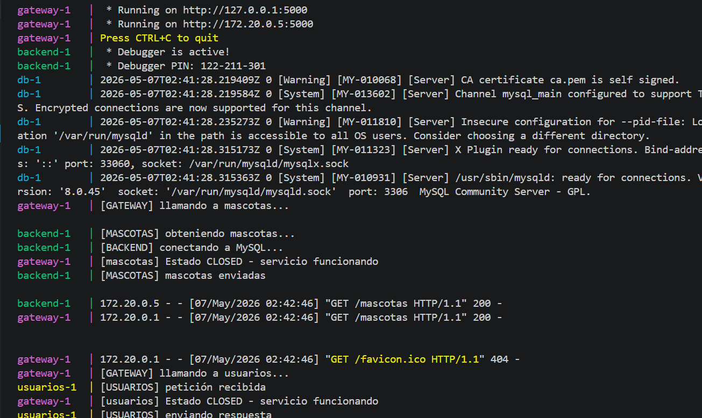
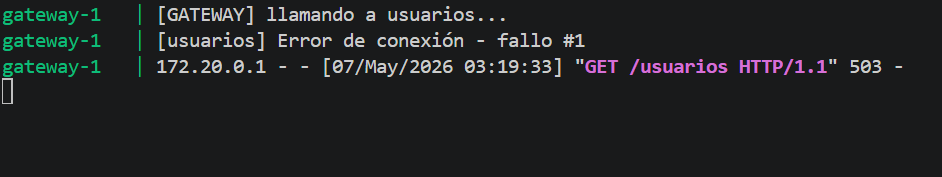
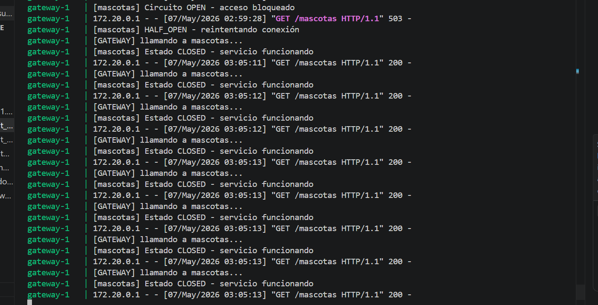
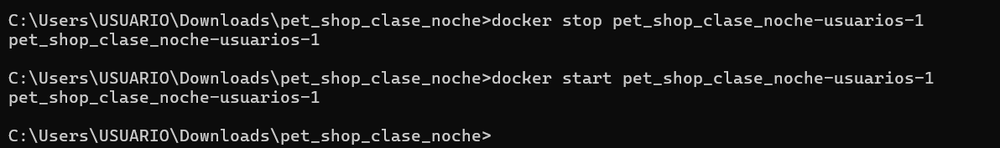

# Laboratorio: Sistema que aprende a fallar – Circuit Breaker


---

# Introducción

En este laboratorio se implementó el patrón Circuit Breaker en un sistema distribuido basado en microservicios utilizando Flask y Docker.

El objetivo fue evitar que el gateway continuara realizando peticiones infinitas a servicios caídos, permitiendo proteger el sistema y mejorar la resiliencia.

Se trabajó con los siguientes servicios:

- Gateway
- Backend mascotas
- Servicio usuarios

---

# Arquitectura del sistema

Cliente → Gateway → Servicios

Servicios implementados:

- /mascotas
- /usuarios
- /relacion

Cada servicio cuenta con un circuito independiente dentro del gateway.

---

# FASE 1 – OBSERVAR
aqui esta la primera fase d el sistema donde esta funcionando correctamente 




## ¿Qué hicimos?

- Se apagó el servicio backend de mascotas y el de usuarios.
- Se realizaron múltiples peticiones al gateway.
- Se revisaron los logs del sistema.

## ¿Qué observamos?

Inicialmente el gateway seguía intentando conectarse al servicio caído.

El sistema:

- insistía continuamente
- generaba errores
- no tenía protección automática

## Logs observados

```text
Error de conexión
Servicio no disponible

FASE 2 – APLICAR (Extensión del Circuit Breaker)

¿Qué hicimos?
Se implementó el patrón Circuit Breaker en múltiples endpoints del gateway.
En lugar de copiar el mismo código para cada endpoint, se creó una función reutilizable:
def llamar_servicio(nombre, url):
Esta función permite manejar:
contador de fallos
estados del circuito
recuperación automática
reutilización de lógica
Decisiones tomadas

¿Cada servicio tiene su propio contador?
Sí.

Cada servicio mantiene:
contador de fallos independiente
estado independiente
tiempo de recuperación propio

¿El circuito se abre de forma independiente?
Sí.
El fallo de un servicio no afecta a los demás.

¿Qué pasa si falla un servicio y el otro sigue funcionando?
El gateway bloquea únicamente el servicio afectado.
Los demás servicios continúan funcionando normalmente.

Logs observados
[usuarios] funcionando
[mascotas] Estado OPEN

FASE 3 – INVESTIGAR (HALF_OPEN)



¿Qué significa HALF_OPEN?
HALF_OPEN es un estado temporal donde el gateway permite realizar una nueva conexión de prueba después de un tiempo de espera.

¿Cuándo se vuelve a intentar la conexión?
Después de que transcurre el tiempo definido en:
RECOVERY_TIME

¿Qué pasa si el servicio vuelve a fallar?
El circuito vuelve a estado OPEN y bloquea nuevamente las solicitudes.
Logs observados
HALF_OPEN - reintentando conexión

FASE 4 – IMPLEMENTAR (Recuperación)


¿Qué implementamos?

Se implementó:

tiempo de espera controlado
reintento automático
recuperación automática
reapertura del circuito si falla nuevamente
Funcionamiento
Estado CLOSED

El servicio funciona normalmente.

Estado OPEN

El gateway bloquea solicitudes al servicio caído.

Estado HALF_OPEN

El gateway realiza una nueva prueba de conexión.

Si funciona → CLOSED
Si falla → OPEN
Logs observados
[mascotas] HALF_OPEN - reintentando conexión
[mascotas] Estado OPEN - demasiados fallos
[mascotas] Circuito OPEN - acceso bloqueado


FASE 5 – VALIDAR


Escenarios probados
1. Servicio funcionando
El circuito permaneció en estado CLOSED.
Logs:
Estado CLOSED - servicio funcionando

2. Servicio caído
El gateway detectó errores consecutivos.
Logs:
Error de conexión - fallo #1

3. Circuito abierto
Después de varios fallos el circuito pasó a OPEN.
Logs:
Estado OPEN - demasiados fallos
Circuito OPEN - acceso bloqueado

4. Recuperación del servicio
Después del tiempo de espera el sistema realizó una nueva conexión.
Logs:
HALF_OPEN - reintentando conexión
Estado CLOSED - servicio funcionando

5. Resiliencia entre servicios
Se apagó el servicio de usuarios mientras mascotas continuó funcionando correctamente.
También se probó el endpoint /relacion, el cual continuó respondiendo parcialmente incluso cuando usuarios estaba caído.

Respuesta obtenida:

{
  "usuario": "Servicio usuarios no disponible",
  "mascota": "Firulais"
}

Esto demostró:
circuitos independientes
tolerancia parcial a fallos
resiliencia del sistema
Código implementado
Gateway

- El gateway implementa:
Circuit Breaker
estados OPEN, CLOSED y HALF_OPEN
contador independiente por servicio
recuperación automática
función reutilizable
Servicios

- Los servicios backend y usuarios mantienen únicamente:
endpoints
lógica de negocio
logs
consultas

La protección se realiza exclusivamente desde el gateway.

- Análisis final
¿Qué cambió en el comportamiento del sistema?
El sistema dejó de insistir infinitamente cuando un servicio fallaba.
Ahora el gateway detecta múltiples errores y bloquea temporalmente las solicitudes al servicio afectado.

¿Qué decisiones tomaron en la implementación?
Se implementaron circuitos independientes por servicio.
Se creó una función reutilizable para evitar duplicar código.
Se implementó recuperación automática mediante HALF_OPEN.
Se agregó tiempo de espera controlado.

¿Qué dificultades encontraron?
La principal dificultad fue manejar correctamente la transición entre los estados OPEN y HALF_OPEN para evitar múltiples intentos innecesarios al backend caído.
También fue necesario controlar correctamente los tiempos de recuperación y los contadores de fallos.

- Conclusión

El patrón Circuit Breaker permitió mejorar la resiliencia del sistema distribuyendo correctamente los fallos entre servicios independientes.
Gracias a la implementación realizada, el gateway ahora puede:
detectar fallos
bloquear conexiones innecesarias
recuperarse automáticamente
mantener disponibles los servicios sanos