# Sistema de Pedidos Distribuido

Este laboratorio implementa un sistema de pedidos distribuido basado en microservicios utilizando Flask y Docker.
Se desarrollaron los servicios de pedidos, inventario, pagos y monitoreo, permitiendo simular fallos, tiempos de espera y errores de comunicación entre servicios.
Además, se implementaron logs descriptivos, health checks y monitoreo básico para analizar la disponibilidad y el comportamiento del sistema ante fallos del servicio de pagos.

---

## Monitoreo implementado

### Fase 1 — Logs descriptivos

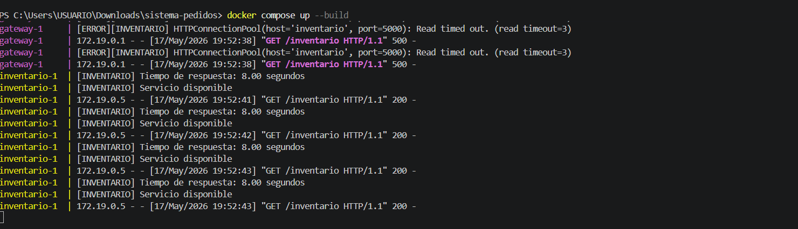
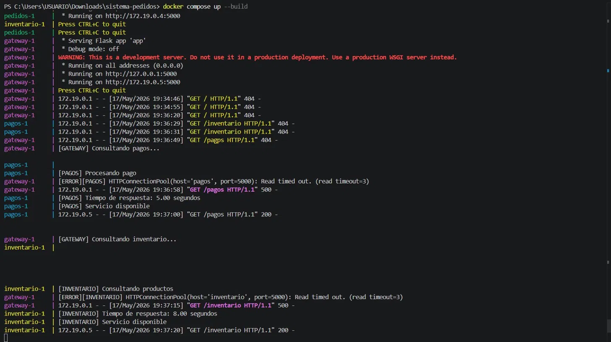

En los logs se observa cómo el gateway monitorea los servicios de pagos e inventario,
registrando tiempos de respuesta, errores de timeout y estados de disponibilidad
para analizar el comportamiento del sistema distribuido.

---

### Fase 2 — Health Checks

Cada servicio expone un endpoint `/health` que retorna su estado actual.
El gateway los consulta individualmente a través de `/estado/pedidos`, `/estado/inventario` y `/estado/pagos`.

**Pedidos**

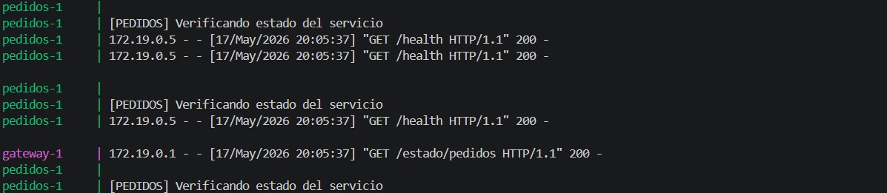

**Inventario**
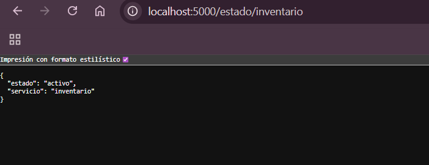
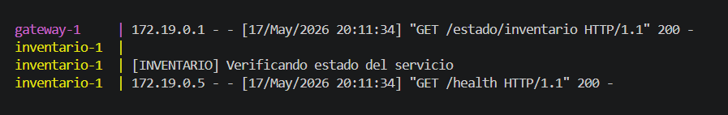

**Pagos**
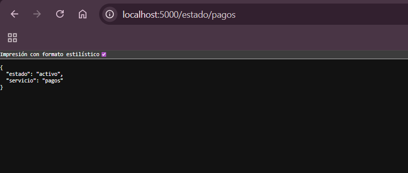
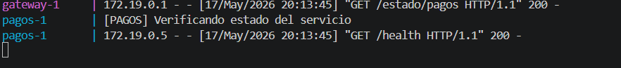

---

### Fase 3 — Monitoreo central

El endpoint `/estado` consulta simultáneamente el `/health` de los tres servicios
y consolida el resultado en un solo JSON, mostrando estado, código HTTP,
tiempo de respuesta y cantidad de veces caído por servicio.

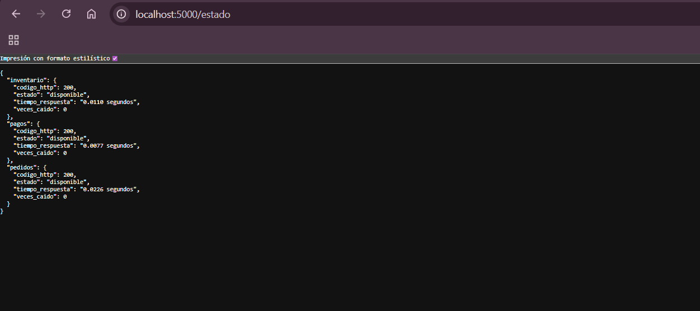

El endpoint `/estado` consulta el `/health` de los tres servicios y consolida
el resultado en un solo JSON. Se observa que pedidos e inventario responden
correctamente con código HTTP 200, mientras que pagos aparece como `caido`
con 3 fallos acumulados, confirmando que el gateway detecta y registra
correctamente las caídas del servicio.

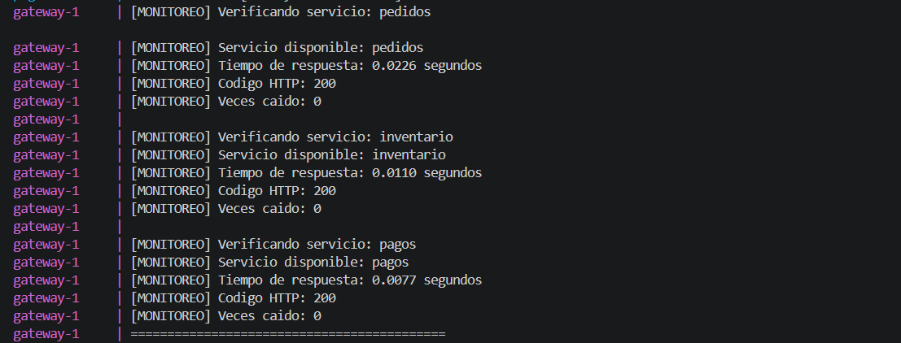

Los logs muestran el ciclo completo de verificación: pedidos responde en 0.0031 segundos
con HTTP 200, mientras que pagos agota el timeout del gateway y genera un `Read timed out`,
registrándose como caído. Esto confirma que el sistema de monitoreo detecta y diferencia
correctamente los servicios disponibles de los caídos en tiempo real.

---

### Fase 4 — Simulación de fallos

Se detiene el servicio de pagos con:

```bash
docker-compose stop pagos
```

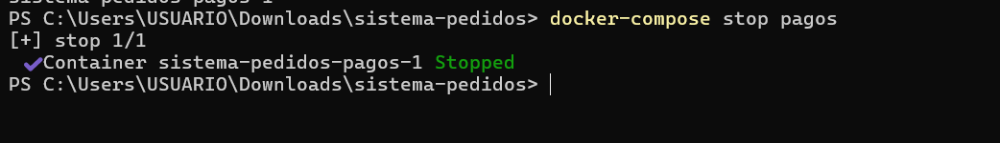

Al llamar al monitoreo con pagos apagado:

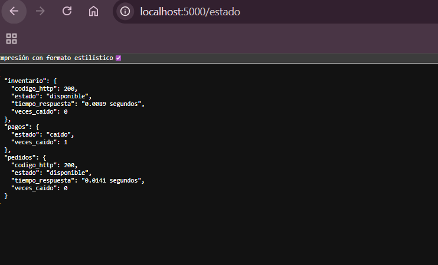
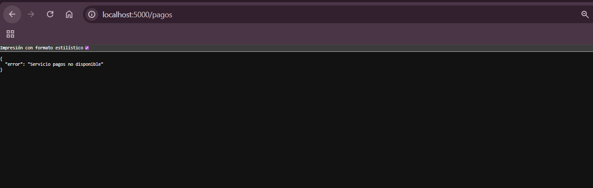

Logs de la terminal durante el fallo:

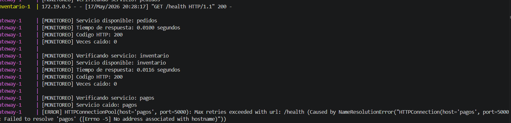

Al detener el servicio de pagos con `docker-compose stop pagos`, el error cambia
de `Read timed out` a `Failed to resolve 'pagos'`, indicando que el contenedor
desapareció completamente de la red Docker. El gateway detecta la caída en el
monitoreo y retorna HTTP 500 en el endpoint `/pagos`, mientras pedidos e
inventario continúan operando con normalidad.

---

### Fase 5 — Métricas

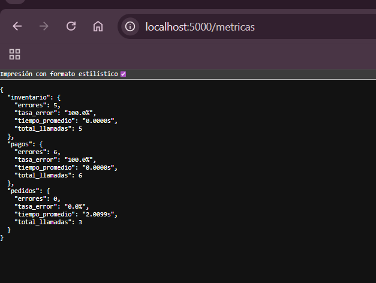

El endpoint `/metricas` muestra el resumen acumulado de todas las llamadas
realizadas durante el taller. Pedidos registra 3 llamadas con 0 errores y
un tiempo promedio de 2.0099s, confirmando que opera correctamente. Inventario
y pagos acumulan 5 y 6 llamadas respectivamente, ambos con tasa de error del
100%, confirmando que ambos servicios fallaron en todas sus llamadas debido
al timeout configurado en el gateway.
